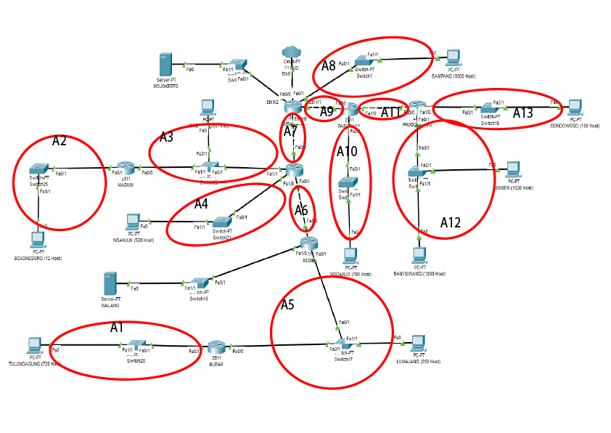
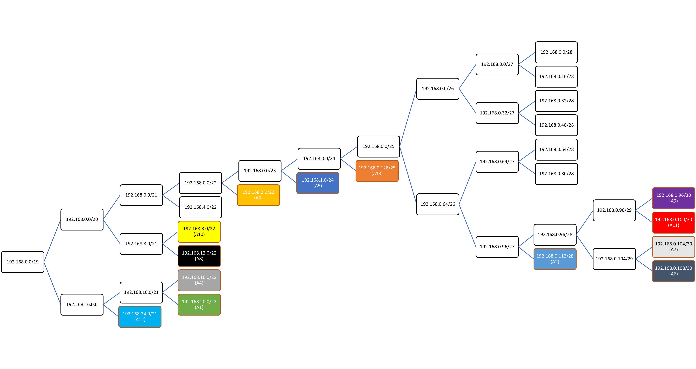
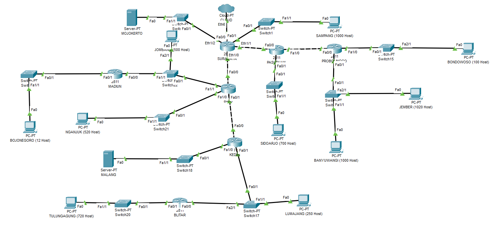

# Jarkom_Modul4_Praktikum_B07

### Kelompok
* 05111840000060 Edo Dwi Yogatama
* 05111840000091 Vincentius Tanubrata

## Cisco Packet Tracer (VLSM)
### Pembagian Subnet

Subnet  | Jumlah IP | Netmask
------------- | ------------- | ------------- 
A1  | 721   | /22
A2  | 12    | /28
A3  | 502   | /23
A4  | 521   | /22
A5  | 252   | /24
A6  | 2     | /30
A7  | 2     | /30
A8  | 1001  | /22
A9  | 2     | /30
A10 | 701   | /22
A11 | 2     | /30
A12 | 2021  | /21
A13 | 101   | /25
Total | 5840 | /19
### Perhitungan

Subnet  | Jumlah IP | Netmask | IP
-   | -     | -     | -
A1  | 721   | /22   | 192.168.20.0/22
A2  | 12    | /28   | 192.168.0.112/28
A3  | 502   | /23   | 192.168.2.0/23
A4  | 521   | /22   | 192.168.16.0/22
A5  | 252   | /24   | 192.168.1.0/24
A6  | 2     | /30   | 192.168.0.108/30
A7  | 2     | /30   | 192.168.0.104/30
A8  | 1001  | /22   | 192.168.12.0/22
A9  | 2     | /30   | 192.168.0.96/30
A10 | 701   | /22   | 192.168.8.0/22
A11 | 2     | /30   | 192.168.0.100/30
A12 | 2021  | /21   | 192.168.24.0/21
A13 | 101   | /25   | 192.168.0.128/25
Total | 5840 | /19
### Implementasi

## UML (CIDR)