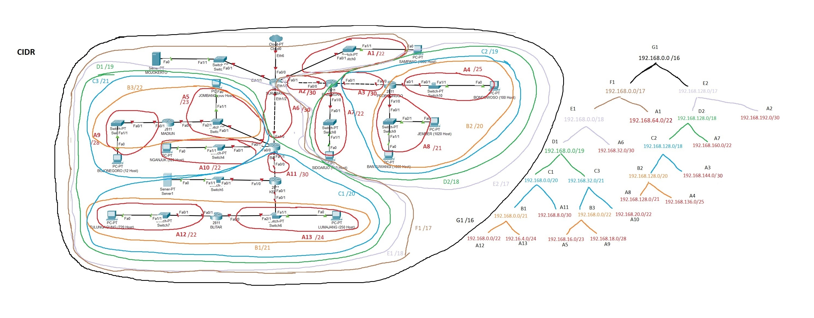

# Jarkom_Modul4_Praktikum_B07

### Kelompok
* 05111840000060 Edo Dwi Yogatama
* 05111840000091 Vincentius Tanubrata

## Cisco Packet Tracer (VLSM)
### Pembagian Subnet


Subnet  | Jumlah IP | Netmask
------------- | ------------- | ------------- 
A1  | 721   | /22
A2  | 12    | /28
A3  | 502   | /23
A4  | 521   | /22
A5  | 252   | /24
A6  | 2     | /30
A7  | 2     | /30
A8  | 1001  | /22
A9  | 2     | /30
A10 | 701   | /22
A11 | 2     | /30
A12 | 2021  | /21
A13 | 101   | /25
Total | 5840 | /19
### Perhitungan


Subnet  | Jumlah IP | Netmask | IP
-----   | -     | -     | -
A1  | 721   | /22   | 192.168.20.0/22
A2  | 12    | /28   | 192.168.0.112/28
A3  | 502   | /23   | 192.168.2.0/23
A4  | 521   | /22   | 192.168.16.0/22
A5  | 252   | /24   | 192.168.1.0/24
A6  | 2     | /30   | 192.168.0.108/30
A7  | 2     | /30   | 192.168.0.104/30
A8  | 1001  | /22   | 192.168.12.0/22
A9  | 2     | /30   | 192.168.0.96/30
A10 | 701   | /22   | 192.168.8.0/22
A11 | 2     | /30   | 192.168.0.100/30
A12 | 2021  | /21   | 192.168.24.0/21
A13 | 101   | /25   | 192.168.0.128/25
Total | 5840 | /19
### Implementasi


## UML (CIDR)
### Pembagian dan perhitungan subnet


### Setting topology.sh
berikut adalah isi dari topology.sh
```
# Router
xterm -T SURABAYA -e linux ubd0=SURABAYA,jarkom umid=SURABAYA eth0=tuntap,,,10.151.74.33 eth1=daemon,,,switch1 eth2
=daemon,,,switch2 eth3=daemon,,,switch7 eth4=daemon,,,switch0 mem=64M &
xterm -T PASURUAN -e linux ubd0=PASURUAN,jarkom umid=PASURUAN eth0=daemon,,,switch2 eth1=daemon,,,switch3 
eth2=daemon,,,switch8 mem=64M &
xterm -T PROBOLINGGO -e linux ubd0=PROBOLINGGO,jarkom umid=PROBOLINGGO eth0=daemon,,,switch3 
eth1=daemon,,,switch4 eth2=daemon,,,switch9 mem=64M &
xterm -T MADIUN -e linux ubd0=MADIUN,jarkom umid=MADIUN eth0=daemon,,,switch6 eth1=daemon,,,switch5 mem=64M &
xterm -T BATU -e linux ubd0=BATU,jarkom umid=BATU eth0=daemon,,,switch7 eth1=daemon,,,switch11 eth2=daemon,,,switch10 
eth3=daemon,,,switch6 mem=64M &
xterm -T KEDIRI -e linux ubd0=KEDIRI,jarkom umid=KEDIRI eth0=daemon,,,switch11 eth1=daemon,,,switch14 
eth2=daemon,,,switch12 mem=64M &
xterm -T BLITAR -e linux ubd0=BLITAR,jarkom umid=BLITAR eth0=daemon,,,switch14 eth1=daemon,,,switch13 mem=64M &

# Server
xterm -T MALANG -e linux ubd0=MALANG,jarkom umid=MALANG eth0=daemon,,,switch12 mem=64M &
xterm -T MOJOKERTO -e linux ubd0=MOJOKERTO,jarkom umid=MOJOKERTO eth0=daemon,,,switch0 mem=64M &

# Klien
xterm -T SIDOARJO -e linux ubd0=SIDOARJO,jarkom umid=SIDOARJO eth0=daemon,,,switch8 mem=64M &
xterm -T SAMPANG -e linux ubd0=SAMPANG,jarkom umid=SAMPANG eth0=daemon,,,switch1 mem=64M &
xterm -T JOMBANG -e linux ubd0=JOMBANG,jarkom umid=GRESIK eth0=daemon,,,switch6 mem=64M &
xterm -T BONDOWOSO -e linux ubd0=BONDOWOSO,jarkom umid=BONDOWOSO eth0=daemon,,,switch4 mem=64M &
xterm -T BOJONEGORO -e linux ubd0=BOJONEGORO,jarkom umid=BOJONEGORO eth0=daemon,,,switch5 mem=64M &
xterm -T JEMBER -e linux ubd0=JEMBER,jarkom umid=JEMBER eth0=daemon,,,switch9 mem=64M &
xterm -T NGANJUK -e linux ubd0=NGANJUK,jarkom umid=NGANJUK eth0=daemon,,,switch10 mem=64M &
xterm -T BANYUWANGI -e linux ubd0=BANYUWANGI,jarkom umid=BANYUWANGI eth0=daemon,,,switch9 mem=64M &
xterm -T TULUNGAGUNG -e linux ubd0=TULUNGAGUNG,jarkom umid=TULUNGAGUNG eth0=daemon,,,switch13 mem=64M &
xterm -T LUMAJANG -e linux ubd0=LUMAJANG,jarkom umid=LUMAJANG eth0=daemon,,,switch14 mem=64M &
```

lalu lakukan bash topology.sh tersebut dan setting interface untuk masing-masing UML

### Interface pada ROUTER
#### SURABAYA
```
auto eth0
iface eth0 inet static
address 10.151.74.34
netmask 255.255.255.252
gateway 10.151.74.33

auto eth1
iface eth1 inet static
address 192.168.64.1
netmask 255.255.252.0

auto eth2
iface eth2 inet static
address 192.168.192.1
netmask 255.255.255.252

auto eth3
iface eth3 inet static
address 192.168.32.1
netmask 255.255.255.252

auto eth4
iface eth4 inet static
address 10.151.83.65
netmask 255.255.255.252

```
#### PASURUAN
```
auto eth0
iface eth0 inet static
address 192.168.192.2
netmask 255.255.255.252
gateway 192.168.192.1

auto eth1
iface eth1 inet static
address 192.168.144.1
netmask 255.255.255.252

auto eth2
iface eth2 inet static
address 192.168.160.1
netmask 255.255.252.0

```

#### PROBOLINGGO
```
auto eth0
iface eth0 inet static
address 192.168.144.2
netmask 255.255.255.252
gateway 192.168.144.1

auto eth1
iface eth1 inet static
address 192.168.136.1
netmask 255.255.255.128

auto eth2
iface eth2 inet static
address 192.168.128.1
netmask 255.255.248.0

```

#### BATU
```
auto eth0
iface eth0 inet static
address 192.168.32.2
netmask 255.255.255.252
gateway 192.168.32.1

auto eth1
iface eth1 inet static
address 192.168.8.1
netmask 255.255.255.252

auto eth2
iface eth2 inet static
address 192.168.20.1
netmask 255.255.252.0

auto eth3
iface eth3 inet static
address 192.168.16.1
netmask 255.255.254.0

```

#### KEDIRI
```
auto eth0
iface eth0 inet static
address 192.168.8.2
netmask 255.255.255.252
gateway 192.168.8.1

auto eth1
iface eth1 inet static
address 192.168.4.1
netmask 255.255.255.0

auto eth2
iface eth2 inet static
address 10.151.83.69
netmask 255.255.255.252

```

#### MADIUN
```
auto eth0
iface eth0 inet static
address 192.168.16.2
netmask 255.255.254.0
gateway 192.168.16.1

auto eth1
iface eth1 inet static
address 192.168.18.1
netmask 255.255.255.240

```
#### BLITAR
```
auto eth0
iface eth0 inet static
address 192.168.4.2
netmask 255.255.255.0
gateway 192.168.4.1

auto eth1
iface eth1 inet static
address 192.168.0.1
netmask 255.255.252.0

```

### Interface pada CLIENT
#### SAMPANG
```
auto eth0
iface eth0 inet static
address 192.168.64.2
netmask 255.255.252.0
gateway 192.168.64.1

```

#### BONDOWOSO
```
auto eth0
iface eth0 inet static
address 192.168.136.2
netmask 255.255.255.128
gateway 192.168.136.1

```

#### JEMBER
```
auto eth0
iface eth0 inet static
address 192.168.128.2
netmask 255.255.248.0
gateway 192.168.128.1

```

#### BANYUWANGI
```
auto eth0
iface eth0 inet static
address 192.168.128.3
netmask 255.255.248.0
gateway 192.168.128.1

```

#### SIDOARJO
```
auto eth0
iface eth0 inet static
address 192.168.160.2
netmask 255.255.252.0
gateway 192.168.160.1

```

#### LUMAJANG
```
auto eth0
iface eth0 inet static
address 192.168.4.3
netmask 255.255.255.0
gateway 192.168.4.1

```

#### TULUNGAGUNG
```
auto eth0
iface eth0 inet static
address 192.168.0.2
netmask 255.255.252.0
gateway 192.168.0.1

```

#### NGANJUK
```
auto eth0
iface eth0 inet static
address 192.168.20.2
netmask 255.255.252.0
gateway 192.168.20.1

```

#### BOJONEGORO
```
auto eth0
iface eth0 inet static
address 192.168.18.2
netmask 255.255.255.240
gateway 192.168.18.1

```

#### JOMBANG
```
auto eth0
iface eth0 inet static
address 192.168.16.3
netmask 255.255.254.0
gateway 192.168.16.1

```

### Interface pada SERVER
#### MOJOKERTO
```
auto eth0
iface eth0 inet static
address 10.151.83.66
netmask 255.255.255.252
gateway 10.151.83.65

```

#### MALANG
```
auto eth0
iface eth0 inet static
address 10.151.83.70
netmask 255.255.255.252
gateway 10.151.83.69

```

Setelah melakukan setting interface, lakukan network restart dan tahap selanjutnya adalah setting routingnya.

### ROUTING
Routing dilakukan pada surabaya, batu, kediri, dan pasuruan

#### Routing pada SURABAYA
```

route add -net 192.168.128.0 netmask 255.255.192.0 gw 192.168.192.2

route add -net 192.168.0.0 netmask 255.255.224.0 gw 192.168.32.2

route add -net 10.151.83.68 netmask 255.255.255.252 gw 192.168.32.2

```
#### Routing pada BATU
```

route add -net 10.151.83.68 netmask 255.255.255.252 gw 192.168.8.2

route add -net 192.168.18.0 netmask 255.255.255.240 gw 192.168.16.2

route add -net 192.168.0.0 netmask 255.255.248.0 gw 192.168.8.2

```

#### Routing pada KEDIRI
```
route add -net 192.168.0.0 netmask 255.255.252.0 gw 192.168.4.2
```

#### Routing pada PASURUAN
```
route add -net 192.168.128.0 netmask 255.255.240.0 gw 192.168.144.2
```
